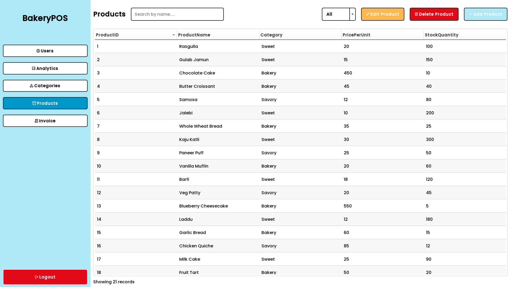

# BakeryPOS
A Point Of Sale System for a Bakery.

## Screenshots



## How to run
#### Qt Creator
You need to have [Qt Creator](https://www.qt.io/development/tools/qt-creator-ide) installed. You have to clone this repo and then open the project in Qt Creator using the _Bakery.pro_ file.
```bash
# cloning the repo into local computer
git clone https://github.com/kazurem/BakeryPOS
```
#### Database 
You need to have [MySql](https://www.mysql.com/) installed on your system too. After that, you'll need to create a user and set their password. Once this has been done, you have to create a database using the _bakerydb.sql_ file. Please make sure that all of the above details match the ones given in the code below.
```cpp
QSqlDatabase db = QSqlDatabase::addDatabase("QMYSQL");
db.setHostName("localhost");
db.setDatabaseName("bakerydb");
db.setUserName("test");
db.setPassword("1234");
db.open();
```
> [!NOTE] 
> This is only a temporary solution, for the purposes of development.
#### Build and Run
Use Qt Creator to build and run the project.
